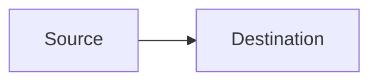

# Mermaid Installation and Configuration

This guide adds Mermaid authoring, validation, and export to the shared
development environment. LikeC4 remains the source of truth for architecture
models. Use Mermaid directly for small diagrams that belong inside Markdown,
and generate Mermaid from LikeC4 when another platform needs Mermaid source.

## Install the pinned CLI

The required Mermaid CLI version is stored in `.mermaid-version`. Install that
version under the active NVM-managed Node.js installation:

```bash
nvm use default
MERMAID_VERSION="$(tr -d '[:space:]' < .mermaid-version)"
npm install --global --allow-scripts=puppeteer \
    "@mermaid-js/mermaid-cli@${MERMAID_VERSION}"
mmdc --version
```

Mermaid CLI uses a headless browser when it parses and renders diagrams. The
browser is therefore part of Mermaid validation and export, but it is not
required for LikeC4 formatting, validation, previews, or Mermaid source
generation.

## Configure VS Code

The workspace recommends these extensions in `.vscode/extensions.json`:

- Mermaid Chart for Mermaid editing and previews
- LikeC4 for architecture-model editing and previews
- markdownlint for Markdown feedback

Install the recommendations in the **WSL: Ubuntu** extension host when VS Code
prompts for them.

## Author diagrams

Embed a small diagram directly in Markdown when the diagram is meaningful only
in that document:

````markdown

````

Use a standalone `.mmd` or `.mermaid` file when the diagram must be validated,
exported, or reused. GitHub renders both standalone extensions.

For architecture diagrams, edit the LikeC4 model and generate Mermaid source:

```bash
likec4 validate
likec4 gen mermaid -o ./exports architecture
```

Generated Mermaid files are publication artifacts, not a second architecture
source of truth.

The repository includes
[a Mermaid workflow example](diagrams/diagram-authoring-workflow.mmd) that also
serves as a render smoke test for the local and CI toolchain.

## Validate and export

Validate every tracked standalone Mermaid file:

```bash
scripts/mermaid-tool.sh validate
```

Validate selected files:

```bash
scripts/mermaid-tool.sh validate docs/diagrams/example.mmd
```

Export a diagram. The output extension selects SVG, PNG, or PDF:

```bash
scripts/mermaid-tool.sh render \
    docs/diagrams/example.mmd \
    exports/example.svg
```

Prefer SVG for published documentation because it remains sharp when scaled.
Commit generated artifacts only when the repository intentionally publishes
them.

The pre-commit hook validates changed `.mmd` and `.mermaid` files. The
path-filtered GitHub Actions workflow installs the pinned CLI and validates all
tracked Mermaid files on pull requests and pushes to `main`.

Markdown code fences are rendered by GitHub but are not extracted by the local
standalone-file hook. Move a diagram into a standalone file when it needs a
blocking local and CI validation guarantee.

## Upgrade

Update `.mermaid-version`, reinstall the CLI, and run the validation suite:

```bash
npm install --global --allow-scripts=puppeteer \
    @mermaid-js/mermaid-cli@NEW_VERSION
mmdc --version
pre-commit run --all-files
```

Review representative diagrams on GitHub after an upgrade because GitHub may
use a different Mermaid version from the pinned workstation and CI renderer.
