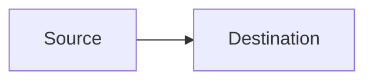

# Mermaid Installation and Configuration

This guide adds Mermaid authoring, validation, and export to the shared
development environment. LikeC4 remains the source of truth for architecture
models. Use Mermaid directly for small diagrams that belong inside Markdown,
and generate Mermaid from LikeC4 when another platform needs Mermaid source.

## Install the pinned CLI

The required Mermaid CLI version is stored in `.mermaid-version`. Install that
version under the active NVM-managed Node.js installation:

```bash
nvm use default
MERMAID_VERSION="$(tr -d '[:space:]' < .mermaid-version)"
npm install --global --allow-scripts=puppeteer \
    "@mermaid-js/mermaid-cli@${MERMAID_VERSION}"
mmdc --version
```

Mermaid CLI uses a headless browser when it parses and renders diagrams. The
browser is therefore part of Mermaid validation and export, but it is not
required for LikeC4 formatting, validation, previews, or Mermaid source
generation.

### Install the matching browser

After installing or updating Mermaid CLI, install the headless-shell revision
selected by its bundled Puppeteer. Package installation can leave the browser
missing if download scripts were skipped. Resolve the installer from the active
`mmdc` executable so it uses that dependency, rather than an unrelated Puppeteer
package fetched by `npx`:

```bash
MERMAID_PUPPETEER_CLI="$(node - "$(command -v mmdc)" <<'JS'
const fs = require('node:fs');
const path = require('node:path');
const { createRequire } = require('node:module');
const fromMermaid = createRequire(fs.realpathSync(process.argv[2]));
const packageFile = fromMermaid.resolve('puppeteer/package.json');
const metadata = JSON.parse(fs.readFileSync(packageFile, 'utf8'));
const entry = typeof metadata.bin === 'string' ? metadata.bin : metadata.bin.puppeteer;
console.log(path.resolve(path.dirname(packageFile), entry));
JS
)"
node "$MERMAID_PUPPETEER_CLI" browsers install chrome-headless-shell
```

Run from this repository under the same user and Node environment used for
`mmdc`. The installer selects its configured supported revision and uses
`~/.cache/puppeteer` by default. Do not substitute `chrome-headless-shell@latest`:
the latest browser may differ from the revision expected by installed Puppeteer.
This does not install a new Mermaid CLI or change Playwright's browser cache.

Verify default launch without an executable-path override:

```bash
env -u MERMAID_PUPPETEER_CONFIG -u PUPPETEER_EXECUTABLE_PATH \
    scripts/mermaid-tool.sh validate
env -u MERMAID_PUPPETEER_CONFIG -u PUPPETEER_EXECUTABLE_PATH \
    pre-commit run --all-files
```

On September 29, 2026, Mermaid CLI 12.0.0 with bundled Puppeteer 25.12.0
required chrome-headless-shell 154.0.8037.57. Installing that revision repaired
default launch; both checks passed without the earlier Chromium override.
These versions record that qualification, not values to hard-code into future
browser installation commands.

### Optional existing browser override

For an intentional alternative browser, use a private JSON configuration file
containing its absolute executable path:

```json
{"executablePath": "/absolute/path/to/installed/chrome"}
```

```bash
MERMAID_PUPPETEER_CONFIG=/private/path/puppeteer.json pre-commit run --all-files
```

Qualify the selected browser with the diagram checks. The override is optional
and is no longer needed for the repaired default installation.

## Configure VS Code

The workspace recommends these extensions in `.vscode/extensions.json`:

- Mermaid Chart for Mermaid editing and previews
- LikeC4 for architecture-model editing and previews
- markdownlint for Markdown feedback

Install the recommendations in the **WSL: Ubuntu** extension host when VS Code
prompts for them.

## Author diagrams

Embed a small diagram directly in Markdown when the diagram is meaningful only
in that document:

````markdown

```mermaid
flowchart LR
    Source --> Destination
```
````

Use a standalone `.mmd` or `.mermaid` file when the diagram must be validated,
exported, or reused. GitHub renders both standalone extensions.

For architecture diagrams, edit the LikeC4 model and generate Mermaid source:

```bash
likec4 validate
likec4 gen mermaid -o ./exports architecture
```

Generated Mermaid files are publication artifacts, not a second architecture
source of truth.

The repository includes
[a Mermaid workflow example](diagrams/diagram-authoring-workflow.mmd) that also
serves as a render smoke test for the local and CI toolchain.

## Validate and export

Validate every tracked standalone Mermaid file:

```bash
scripts/mermaid-tool.sh validate
```

Validate selected files:

```bash
scripts/mermaid-tool.sh validate docs/diagrams/example.mmd
```

Export a diagram. The output extension selects SVG, PNG, or PDF:

```bash
scripts/mermaid-tool.sh render \
    docs/diagrams/example.mmd \
    exports/example.svg
```

Prefer SVG for published documentation because it remains sharp when scaled.
Commit generated artifacts only when the repository intentionally publishes
them.

The pre-commit hook validates changed `.mmd` and `.mermaid` files. The
path-filtered GitHub Actions workflow installs the pinned CLI and validates all
tracked Mermaid files on pull requests and pushes to `main`.

Markdown code fences are rendered by GitHub but are not extracted by the local
standalone-file hook. Move a diagram into a standalone file when it needs a
blocking local and CI validation guarantee.

## Upgrade

Use the latest published stable CLI release. Query the registry, update the exact
version in `.mermaid-version`, and install only if the existing CLI differs. Keep
the exact pin so local and CI validation use the same reviewed release.

```bash
npm view @mermaid-js/mermaid-cli version
```

On September 29, 2026, the registry returned 12.0.0, already installed locally.
The repository pin was advanced from 11.16.0 to 12.0.0 without a runtime change.
For a later version change, install the selected release:

```bash
npm install --global --allow-scripts=puppeteer \
    @mermaid-js/mermaid-cli@NEW_VERSION
mmdc --version
```

Then repeat [Install the matching browser](#install-the-matching-browser),
including both validation commands without the override. Resolve the installer
again after each CLI upgrade because the bundled Puppeteer version or path can
change. A successful package installation alone is not browser qualification.

Review representative diagrams on GitHub after an upgrade because GitHub may
use a different Mermaid version from the pinned workstation and CI renderer.
